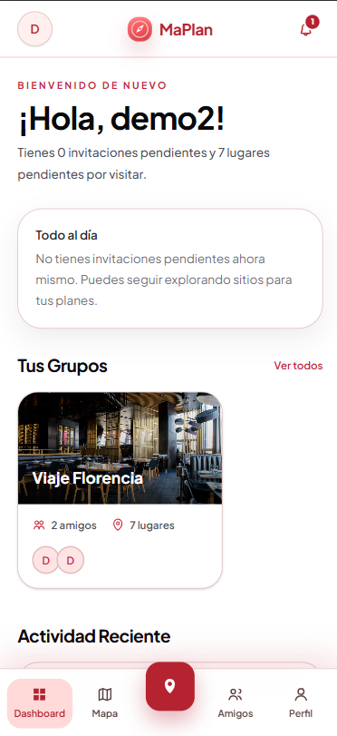
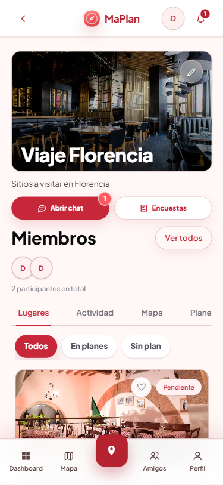
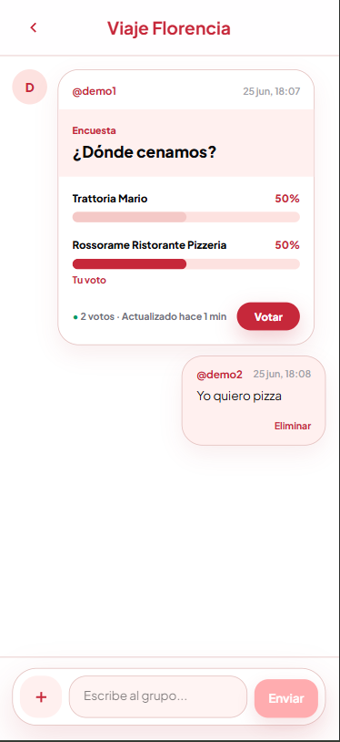
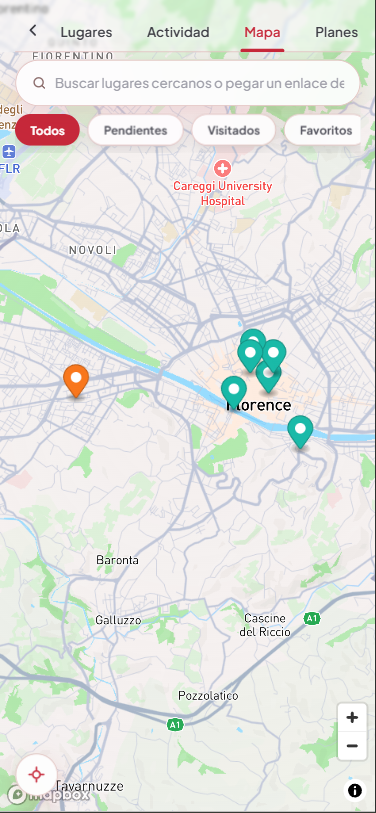
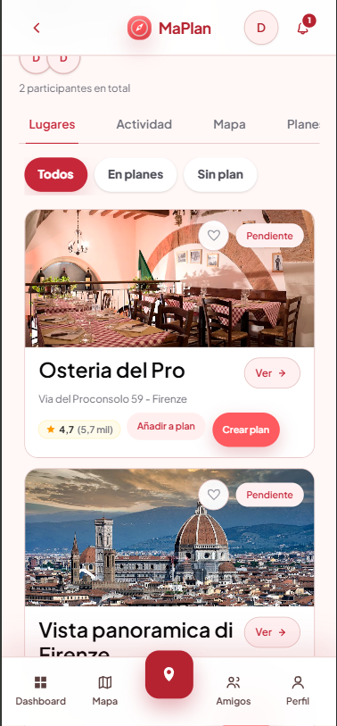
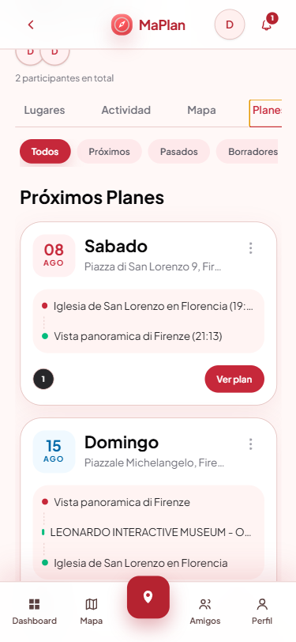
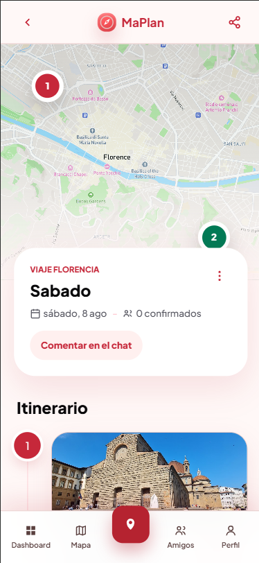
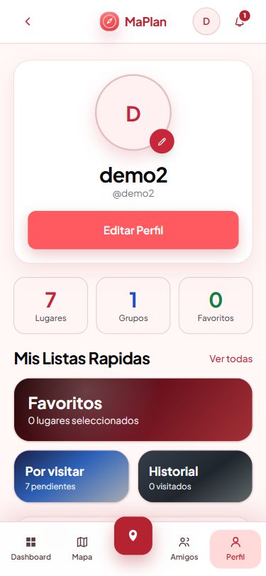

# 🗺️ MaPlan

MaPlan es una aplicación social de mapas para guardar, organizar y compartir lugares con amigos. El proyecto permite crear grupos, explorar sitios, guardar recomendaciones, planificar rutas, votar decisiones y comentar en chats grupales.

Versión desplegada: [https://maplan.vercel.app/](https://maplan.vercel.app/)

## ✨ Descripción general

La idea principal de MaPlan es convertir el mapa en un espacio colaborativo. Cada usuario puede tener su propio mapa personal y, además, participar en grupos donde se comparten lugares, planes, encuestas y mensajes.

El prototipo está orientado a planificación social: viajes, cenas, rutas, sitios pendientes, favoritos y coordinación entre miembros de un grupo.

## 📸 Capturas

| Dashboard | Grupo |
| --- | --- |
|  |  |

| Chat | Mapa |
| --- | --- |
|  |  |

| Lugares guardados | Planes |
| --- | --- |
|  |  |

| Detalle de plan | Perfil |
| --- | --- |
|  |  |

## 🧰 Stack tecnológico

- Next.js App Router
- React
- TypeScript en modo estricto
- Tailwind CSS
- Supabase Auth
- Supabase Postgres
- Supabase RLS
- Supabase Realtime
- Mapbox GL
- Google Places mediante API routes server-side
- Zod
- Vitest
- Playwright
- pnpm
- Vercel

El package manager está fijado en `package.json`:

```json
"packageManager": "pnpm@10.11.0"
```

## 🚀 Instalación y ejecución

Instalar dependencias:

```bash
pnpm install
```

Crear un archivo `.env` en la raíz del proyecto:

```bash
NEXT_PUBLIC_SUPABASE_URL=
NEXT_PUBLIC_SUPABASE_ANON_KEY=
SUPABASE_SERVICE_ROLE_KEY=
NEXT_PUBLIC_MAPBOX_TOKEN=
NEXT_PUBLIC_MAPBOX_STYLE=
GOOGLE_PLACES_API_KEY=
```

`NEXT_PUBLIC_MAPBOX_STYLE` es opcional. No hace falta añadirla al `.env` si solo se quiere usar el estilo por defecto de Mapbox con `NEXT_PUBLIC_MAPBOX_TOKEN`.

Ejecutar en desarrollo:

```bash
pnpm dev
```

Compilar para producción:

```bash
pnpm build
pnpm start
```

Comandos útiles:

```bash
pnpm lint
pnpm test
pnpm test:e2e
pnpm test:e2e:ui
pnpm test:e2e:headed
pnpm test:e2e:report
```

Variables opcionales para Playwright:

```bash
E2E_EMAIL=
E2E_PASSWORD=
E2E_RUN_SIGNUP=1
PLAYWRIGHT_BASE_URL=
```

## 🔐 Usuarios de prueba

La aplicación tiene login. Para probar el proyecto se pueden usar estas cuentas:

| Usuario | Correo electrónico | Contraseña |
| --- | --- | --- |
| Demo 1 | `demo1@example.com` | `MaPlanDemo2026!` |
| Demo 2 | `demo2@example.com` | `MaPlanDemo2026!` |

Estas credenciales son solo para demostraciones y pruebas del prototipo.

## 📁 Estructura del proyecto

- `app/`: rutas App Router, layouts, route handlers y server actions.
- `components/`: componentes reutilizables y vistas de funcionalidad.
- `components/groups/`: grupos, miembros, lugares, planes, encuestas, chat y permisos.
- `components/map/`: Mapbox, mapa personal, mapa de grupo, tarjetas y buscador.
- `components/explore/`: mapa principal de exploración y guardado multi-destino.
- `components/maps/`: selector entre mapas grupales y mapa personal.
- `components/profile/`: perfil, listas personales y logros.
- `components/ui/`: primitivas visuales reutilizables.
- `lib/`: lógica de dominio, permisos, validación, Supabase y helpers.
- `lib/map/`: Google Places, geocoding, distancias, URLs de Google Maps y clasificación.
- `lib/validation/`: schemas Zod.
- `types/`: tipos compartidos y tipos de Supabase.
- `supabase/`: SQL, migraciones manuales y políticas RLS.
- `tests/`: tests de Vitest.
- `e2e/`: tests de Playwright.
- `utils/constants.ts`: constantes globales y rutas principales.

## ⭐ Funcionalidades principales

### 🔒 Autenticación y seguridad

- Registro e inicio de sesión con Supabase Auth.
- Protección de datos mediante RLS.
- Validaciones server-side con Zod.
- Server actions con autenticación y comprobación de permisos.
- Service role limitado a código server-side.

### 🔔 Dashboard y notificaciones

- Dashboard con grupos, invitaciones y actividad reciente.
- Actividad reciente filtrada para mostrar acciones de otros usuarios.
- Campana de notificaciones con contador.
- Notificaciones Realtime sin polling continuo.
- Mensajes no leídos de chats de grupo.
- Avisos de invitaciones, solicitudes y actividad relevante de grupos.

### 👥 Grupos

- Creación de grupos.
- Grupos `abierto` y `privado`.
- Roles `owner` y `member`.
- Invitaciones de grupo.
- Solicitudes para unirse a grupos.
- Gestión de miembros.
- Vista de grupo con pestañas: `Lugares`, `Actividad`, `Mapa` y `Planes`.
- Botones compactos para abrir chat y encuestas desde el resumen del grupo.

### 📍 Lugares de grupo

- Guardado de lugares en grupos.
- Búsqueda con Google Places.
- Visualización en Mapbox.
- Estados personales por usuario: `Pendiente`, `Visitado` y `Favorito`.
- Filtros y tarjetas compactas.
- Sincronización Realtime para que los lugares nuevos, editados o eliminados aparezcan a otros miembros sin recargar.

### 🧭 Mapa personal

- Mapa propio para guardar lugares personales.
- Pestañas `Lugares` y `Mapa`.
- Estados `Pendiente`, `Visitado` y `Favorito`.
- Vista de lugar seleccionable desde enlaces internos.
- Búsqueda y guardado desde mapa.

### 🔎 Explore

- Mapa principal inmersivo en `/explore`.
- Búsqueda de lugares con Google Places.
- Selección de sitios desde el mapa.
- Guardado en mapa personal o en grupos permitidos.
- Validación de permisos también en backend.

### 🗓️ Planes de grupo

- Creación de planes desde un grupo o desde una tarjeta de lugar.
- Vista independiente de detalle de plan.
- Edición inline de nombre, fecha, horas y paradas.
- Eliminación de paradas.
- Eliminación de planes.
- Votos de asistencia: `Iré`, `Quizás` y `No`.
- Paradas con snapshot para que sobrevivan aunque se borre el lugar original.
- Lugares no guardados pueden añadirse a un plan sin guardarse automáticamente como lugar del grupo.
- Tarjetas resumen con hasta 4 lugares y contador `+N`.
- Orden por hora y reordenación manual de paradas.
- Planes compartibles por enlace público en modo solo lectura.
- En grupos abiertos, los miembros pueden editar planes.
- En grupos privados, la edición queda reservada al propietario.

### 🗳️ Encuestas

- Encuestas de grupo centradas en votar entre lugares guardados.
- Creación de encuestas desde `/groups/[groupId]/decisions`.
- Voto único por usuario y posibilidad de cambiarlo mientras la encuesta esté abierta.
- Resultados con ganador o empate.
- Encuestas compartibles en el chat.
- Voto desde tarjetas compactas dentro del chat.

### 💬 Chat grupal

- Chat independiente a pantalla completa por grupo.
- Mensajes en tiempo real mediante Supabase Realtime.
- Contador de no leídos en el botón de chat.
- Contexto de lugares, planes y encuestas.
- Tarjetas de contexto enlazables.
- Eliminación de mensajes propios.
- El chat muestra el nombre del grupo en la cabecera.

### 👤 Perfil y listas

- Perfil editable.
- Contadores reales basados en datos guardados.
- Logros de explorador.
- Listas globales en `/profile/places`:
  - todos;
  - favoritos;
  - pendientes;
  - visitados.
- Tarjetas compactas.
- Acciones directas para marcar `Visitado` / `Pendiente` y añadir o quitar favoritos.
- Botón `Ver` que abre el lugar dentro de MaPlan:
  - si es de grupo, abre el mapa del grupo con el lugar seleccionado;
  - si es personal, abre el mapa personal con el lugar seleccionado.
- Desde la tarjeta del mapa se puede abrir Google Maps.

### 🤝 Amigos

- Búsqueda de amigos.
- Autocomplete en la propia barra de búsqueda.
- Solicitudes de amistad.
- Estados de solicitud y amistad.

## 🧭 Rutas principales

- `/`
- `/login`
- `/register`
- `/dashboard`
- `/friends`
- `/invitations`
- `/notifications`
- `/groups`
- `/groups/new`
- `/groups/join`
- `/groups/[groupId]`
- `/groups/[groupId]/chat`
- `/groups/[groupId]/decisions`
- `/groups/[groupId]/plans/[planId]`
- `/plans/share/[token]`
- `/maps`
- `/map`
- `/explore`
- `/profile`
- `/profile/places`
- `/terms`
- `/privacy`

## 🗄️ Base de datos y SQL

Los scripts SQL se encuentran en `supabase/`. El orden recomendado de ejecución en Supabase SQL Editor es:

1. `supabase/profiles_full_name.sql`
2. `supabase/rls_friends.sql`
3. `supabase/groups_cover_image_url.sql`
4. `supabase/groups_privacy.sql`
5. `supabase/rls_groups.sql`
6. `supabase/rls_group_invitations.sql`
7. `supabase/rls_group_activity.sql`
8. `supabase/places_links.sql`
9. `supabase/places_external_provider.sql`
10. `supabase/places_city.sql`
11. `supabase/rls_places.sql`
12. `supabase/group_place_user_states.sql`
13. `supabase/rls_personal_places.sql`
14. `supabase/places_images.sql`
15. `supabase/places_favorites.sql`
16. `supabase/places_phone_number.sql`
17. `supabase/places_google_metadata.sql`
18. `supabase/group_plans.sql`
19. `supabase/group_polls.sql`
20. `supabase/group_chat.sql`
21. `supabase/notifications_realtime.sql`

Notas:

- Los scripts son mayoritariamente idempotentes.
- `group_plans.sql` crea planes, paradas, snapshots, votos de asistencia, permisos y políticas RLS.
- `group_polls.sql` crea encuestas de lugares, opciones y votos.
- `group_chat.sql` crea chat grupal y lecturas por usuario.
- `notifications_realtime.sql` activa Realtime para notificaciones, chat, lugares y planes.
- RLS debe mantenerse activo en las tablas sensibles.

## ✅ Testing

Tests unitarios, dominio, acciones y seguridad:

- `tests/lib/*`
- `tests/actions/*`
- `tests/validation/*`
- `tests/security/*`

Tests end-to-end:

- `e2e/auth.spec.ts`
- `e2e/legal.spec.ts`
- `e2e/navigation.spec.ts`
- `e2e/groups.spec.ts`
- `e2e/map.spec.ts`
- `e2e/notifications.spec.ts`

Ejecutar:

```bash
pnpm test
pnpm test:e2e
```

## 🛡️ Seguridad y variables

- No commitear `.env` ni secretos.
- Mantener `GOOGLE_PLACES_API_KEY` solo server-side.
- No crear `NEXT_PUBLIC_GOOGLE_PLACES_API_KEY`.
- Mantener `SUPABASE_SERVICE_ROLE_KEY` solo server-side.
- No usar service role en componentes cliente.
- `NEXT_PUBLIC_SUPABASE_ANON_KEY` es pública por diseño, pero RLS protege los datos.
- `NEXT_PUBLIC_MAPBOX_TOKEN` es pública por diseño.

## 🧯 Troubleshooting

- Si `pnpm` no existe, instalar pnpm/Corepack antes de cambiar de package manager.
- Si Mapbox no carga, revisar `NEXT_PUBLIC_MAPBOX_TOKEN`.
- Si Google Places no responde, revisar `GOOGLE_PLACES_API_KEY`.
- Si la ubicación del navegador no funciona, usar HTTPS o `localhost` y revisar permisos.
- Si Realtime no actualiza, comprobar que las tablas necesarias están activadas en `supabase_realtime`.
- Si el mapa aparece gris o mal dimensionado, revisar `components/map/useMapboxResize.ts`.

## 📌 Estado actual

MaPlan funciona como prototipo completo de planificación social: autenticación, grupos, lugares, mapas, planes, encuestas, chat, notificaciones Realtime, perfil, listas y enlaces públicos de planes. La aplicación está preparada para demostración en Vercel y para ejecución local con las variables de entorno indicadas.

## 🔮 Mejoras futuras

Como evolución futura, MaPlan podría incorporar una capa de caché cliente mediante SWR o TanStack Query. Esto permitiría mantener datos previos al navegar entre vistas, reducir la aparición de estados de carga, aplicar actualizaciones optimistas y sincronizar en segundo plano los cambios recibidos por Supabase Realtime.

Las zonas donde esta mejora tendría mayor impacto serían:

- chat grupal, para mensajes y tarjetas de encuestas casi instantáneas;
- planes de grupo, para volver al listado o al detalle sin esperas perceptibles;
- lugares de grupo, para marcar favoritos, visitados o guardar sitios con respuesta inmediata;
- perfil y listas, para conservar el estado local mientras se revalidan datos.

Esta optimización se plantea como una mejora progresiva, manteniendo Supabase, RLS y las server actions como fuente de verdad.
